# koda-b7-deployment

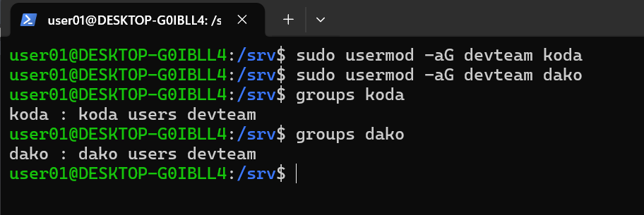
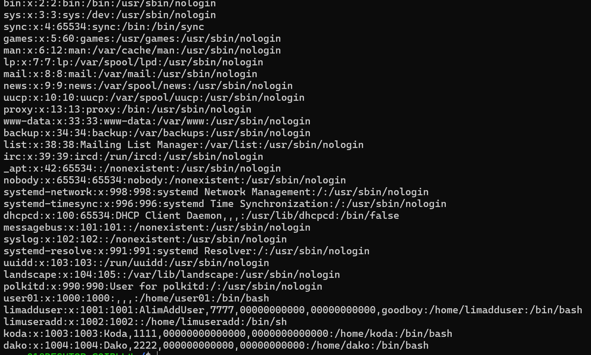

## 1 INITIAL SETUP

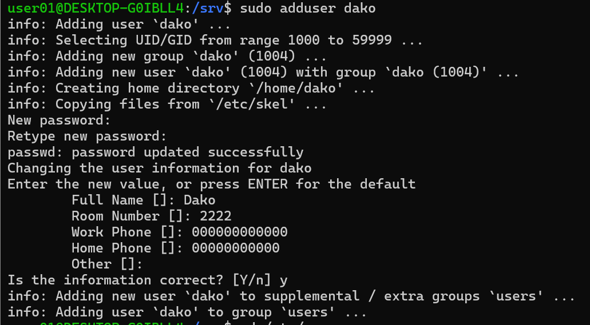
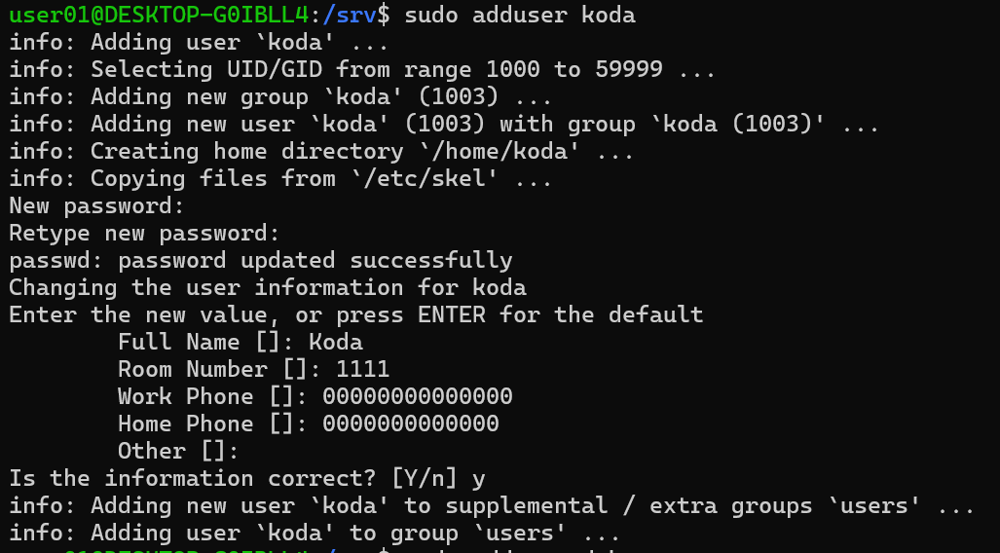
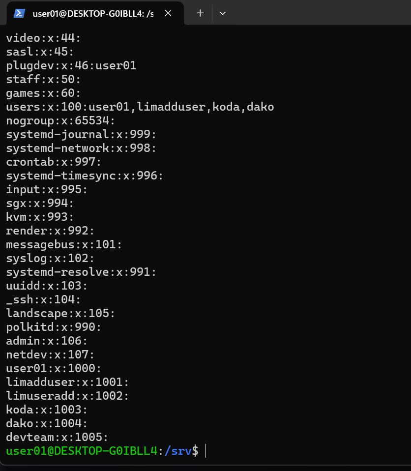

## 2 Make Koda the owner and devteam group owner of /srv/projectX/

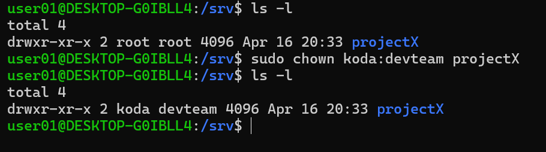

## 3 Restricting access

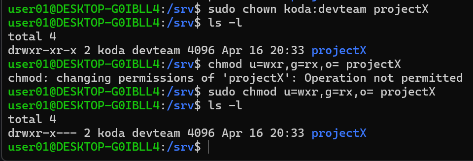

## 4 as user koda, create structur folder

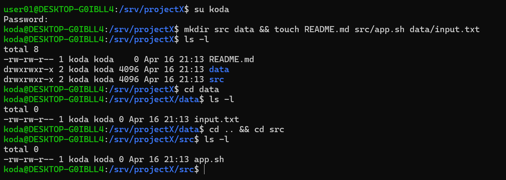

## 5 Fixing permissions

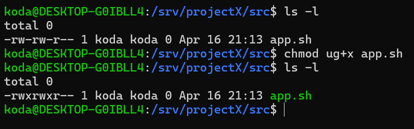

## 6 Protecting sensitive data

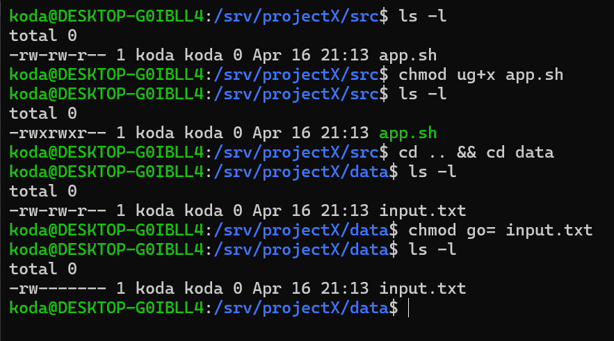

## 7 Allow Group Collaboration

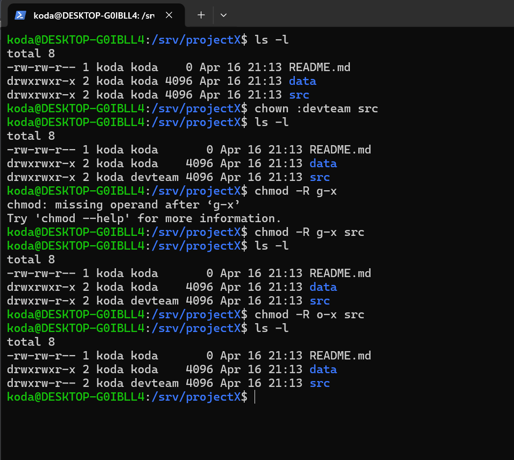

## 8 Change ownership too

## 9 Prevent accidental deletion

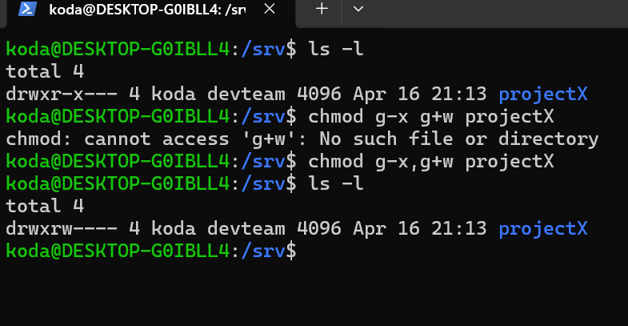

## 10 Make README.md read-only

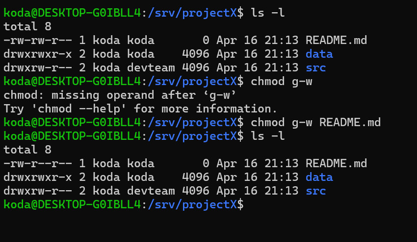

## 11 Resignation and project handover

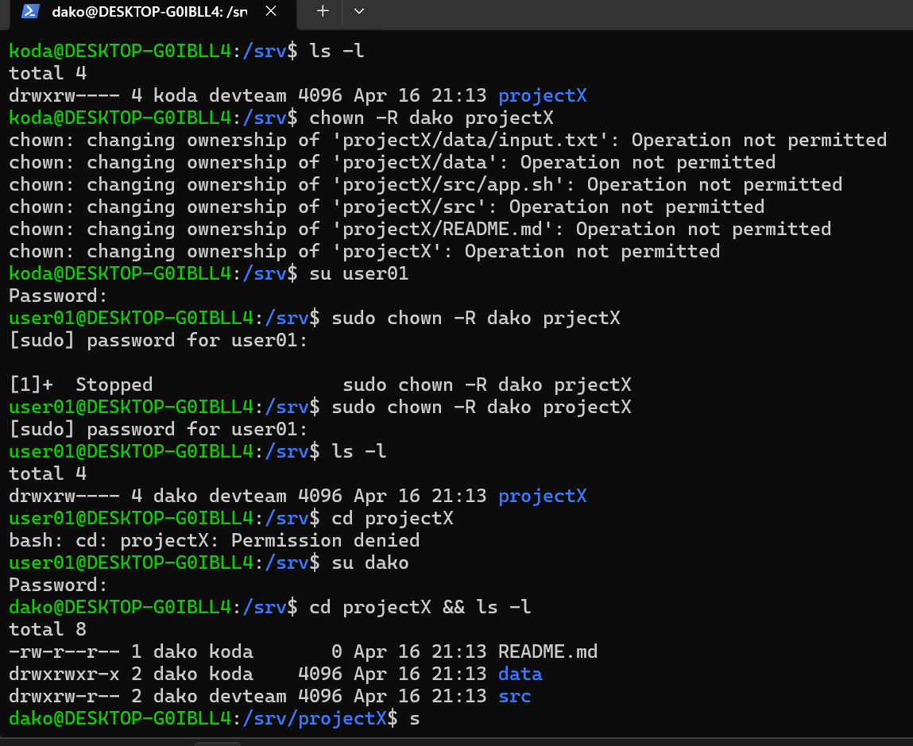
